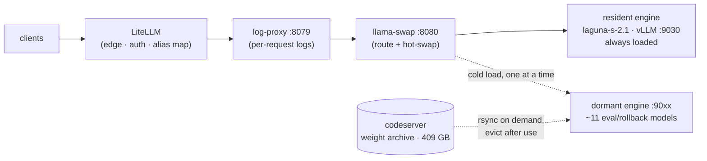

# Spark LLM Stack

Production LLM serving on a single **NVIDIA DGX Spark (GB10, 119 GB unified memory)**: an OpenAI-compatible gateway serving real, paid coding traffic since April 2026. One box, ~14 routable models behind one endpoint — call `http://192.168.1.12:8079/v1` and route by the `model` field.

The defining constraint: weights, KV cache, speculative drafter, and the host OS all share one 119 GB unified-memory budget on a bandwidth-bound SoC — and a host OOM **hard-hangs the machine** with no remote recovery. Most of what's in this repo is measured answers to *what fits, what it costs, and whether it's worth it* — including the experiments that failed. The [decision log](docs/decisions.md) (35 entries) records both.

## Architecture



Two tiers:

- **Resident** — a single always-loaded coding default (`laguna-s-2.1`, poolside Laguna S-2.1: 118B-A8.5B MoE, NVFP4 + DFlash speculative decoding). Holds the box at `util 0.85 / ctx 262144`; legacy route names (`qwen3.6-27b`, `qwen3.6-35b-a3b`, `nemotron-3-puzzle-75b`) resolve to it at the gateway.
- **Dormant** — ~11 eval/rollback models whose weights live **off-box** and rsync back on demand (1–3 min for most), serve swap-exclusively, then evict. The Spark's NVMe went 95 % → 48 % used without deleting a single model.

Full topology, groups, and copy-back mechanics: [docs/operations.md](docs/operations.md).

## Engineering notes

The parts of this stack that were *earned* rather than configured:

- **Speculative decoding is measured, not assumed.** The coding default has been through seven production configs since April 2026, each promoted or demoted on real-traffic-shaped A/Bs (13 k / 60 k / 100 k prompt buckets, per-position acceptance scraped from the engine). Standing findings: drafter acceptance collapses on random-text harnesses (never bench spec-decode with synthetic noise), draft positions 7–14 still carry 17 % of accepted tokens on code (so n=15 beats the community's n=7), and the drafter's KV dtype must match the target's — a mismatch measured **0.01 % acceptance** ([§35](docs/decisions.md#35-vllm-0260-trial--reverted-drafter-revision-pinned-2026-07-30)).
- **Upgrades must pay rent.** vLLM v0.26.0 was trialled against the prefill bottleneck and reverted the same day: TTFT unimproved, acceptance down, cudagraph mode downgraded ([§35](docs/decisions.md#35-vllm-0260-trial--reverted-drafter-revision-pinned-2026-07-30)). The Qwen 35B MoE was rejected as coding default on quality (−4 pts SWE-bench vs the dense 27B) despite being ~2× faster single-stream ([models.md](docs/models.md#what-each-model-is-for)).
- **Unified-memory co-residency has real math.** Measured on the way to a parked two-engine config: the resident's non-KV footprint is ~70.6 GB, KV costs 38.4 KB/token, and a second vLLM engine's *weight-load transient* spikes ~5–6 GB above steady state — enough to trip the host-OOM floor on a machine that hard-hangs. The lane is parked with its revival preconditions documented in the launcher header ([§34](docs/decisions.md#34-laguna-concurrency-ceiling--seqs-8-deadlock-qwen-co-residency-parked-2026-07-24)).
- **Failure modes are first-class documentation.** The engine-core deadlock at `max-num-seqs 8` + DFlash (token counter frozen while `/health` returns 200 — the worst kind), the sm_121 Marlin-kernel garbage-output bug and its CUTLASS workaround, the GB10 allocator confounder that fakes 44× decode swings between bench runs — all reproduced, written down, and wired into config guards rather than left as tribal knowledge.
- **Supply-chain hygiene, learned the honest way.** All model weights are revision-pinned — including the speculative drafter, after an upstream re-upload reached production silently on a routine restart. The failure window and the fix are both in [§35](docs/decisions.md#35-vllm-0260-trial--reverted-drafter-revision-pinned-2026-07-30).

## Models

Compact view — the full matrix with launchers, memory, and per-model footnotes is in [docs/models.md](docs/models.md).

| Route (`model`) | Tier | Use it for | tok/s | Max ctx | Engine |
|---|---|---|---:|---:|---|
| **`laguna-s-2.1`** | **resident** | **coding — default** | 43–54 | **256 k** | vLLM |
| `nemotron-3-puzzle-75b` | parked | coding — rollback (default 07-08 → 07-22) | 28 | 131 k | vLLM |
| `qwen3.6-35b-a3b-vision` | dark | vision — no headroom beside laguna | 56 | 131 k | vLLM |
| `qwen3.6-27b-int4-dflash` | copy-back | coding — rollback target | 29 | 120 k | vLLM |
| `qwen3.6-35b-a3b-nvfp4` | copy-back | coding, long-ctx throughput | 56 | 131 k | vLLM |
| `qwen3.6-27b-nvfp4` | copy-back | coding — 256 k ctx lane | 31 | **256 k** | vLLM |
| `qwen3.6-27b-nvfp4-vision` | copy-back | vision at 256 k ctx | 31 | **256 k** | vLLM |
| `ornith-1.0-35b` | copy-back | agentic coding (thinking) | 77 | 131 k | llama.cpp |
| `qwopus3.6-27b-int4-dflash` | copy-back | coding — Opus-distilled | 39 | 131 k | vLLM |
| `qwen3.6-27b-fp8` | copy-back | quality baseline | 21 | 131 k | vLLM |
| `nemotron-3-nano-omni` | copy-back | multimodal (image/audio/video) | 56 | 131 k | vLLM |
| `cosmos3-nano-omni` | copy-back | image/video *generation* | ~6 s/img | — | vLLM-Omni |
| `diffusiongemma-26b` | copy-back | speed / non-coding (diffusion LLM) | 116 | 131 k | vLLM |
| `deepseek-v4-flash-ds4` | copy-back | long-context planner | 21 | 131 k | ds4 (C/CUDA) |

## Quickstart

```sh
curl http://192.168.1.12:8079/v1/chat/completions -H 'Content-Type: application/json' -d '{
  "model": "laguna-s-2.1",
  "messages": [{"role": "user", "content": "hi"}]
}'
# Resident models answer immediately. A copy-back model first rsyncs its weights
# from the archive host — set client timeout ≥ 1200 s (matches llama-swap healthCheckTimeout).
# :8079 is the logged path (log-proxy → llama-swap); :8080 hits the gateway directly.
```

```sh
curl -s http://192.168.1.12:8080/v1/models | jq -r '.data[].id'   # list routes
curl -s http://192.168.1.12:8080/running                          # which model is hot
python3 bin/bench-models.py                                       # full characterisation sweep
```

Day-2 operations (logs, rollback, force-unload): [docs/operations.md](docs/operations.md) · adding a model: [docs/models.md](docs/models.md#adding-a-model).

## Hardware

- **NVIDIA DGX Spark (GB10)** — Grace/Blackwell SoC, compute capability **12.1** (the GB10 chiplet — often mis-detected as generic-Blackwell SM120, which is how the Marlin garbage-output bug happens).
- **119 GB unified memory** — no separate VRAM; CPU and GPU share physical DRAM over NVLink-C2C. `--gpu-memory-utilization 0.85` ≈ 101 GB.
- **Native FP4/FP8 matmul** — production leans on both (NVFP4 weights via CUTLASS, fp8 KV).
- **Single NVMe** — multi-GB/s sequential, but default llama.cpp mmap paths cap at ~200 MB/s; `--no-mmap` recovers it ([§6](docs/decisions.md#6---no-mmap-for-llamacpp-on-spark)).

## Repo map

```
bin/        launchers (one script per model, header-documented), bench suite,
            log-proxy, copyback-launch.sh, TUIs
config/     llama-swap.yaml (ACTIVE — live-watched: edits ARE deployments) + full-roster backup
deployed.yaml   LiteLLM model_list for the edge gateway
systemd/    service units (llama-swap, log-proxy, stack-api)
etc/        chat templates, copy-back eviction manifest
docs/       everything below
logs/       gateway logs, per-request proxy triples, timestamped bench JSON
```

| Doc | Contents |
|---|---|
| [docs/models.md](docs/models.md) | Full model matrix, what each model is for, per-launcher configuration + why |
| [docs/operations.md](docs/operations.md) | Gateway, two-tier groups, weight offload/copy-back, runbook, rollback, troubleshooting |
| [docs/decisions.md](docs/decisions.md) | Decision log §1–§35 — every non-obvious choice, with the measurements behind it |
| [docs/benchmarks.md](docs/benchmarks.md) | Bench tooling + the historical archive of each production era |
| [docs/qwen3.6-27b-dflash.md](docs/qwen3.6-27b-dflash.md) | Deep dive: DFlash speculative decoding on the dense 27B |
| [docs/deepseek-v4-flash.md](docs/deepseek-v4-flash.md) | Deep dive: DeepSeek V4-Flash on the ds4 C/CUDA engine |

---

*Current production (2026-07-30): `laguna-s-2.1` solo resident — vLLM 0.25.1, NVFP4 + DFlash n=15, revision-pinned target and drafter, `util 0.85 / ctx 262144 / seqs 4`, ~33 tok/s @100 k, 54 tok/s short. Watchdog-covered; config is live-watched, so yaml edits are production deployments.*
