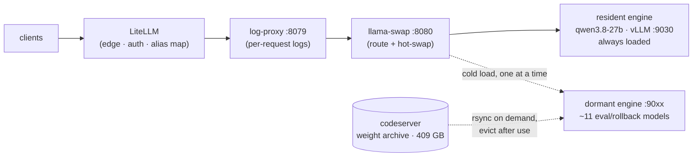

# Spark LLM Stack

Production LLM serving on a single **NVIDIA DGX Spark (GB10, 119 GB unified memory)**: an OpenAI-compatible gateway serving real, paid coding traffic since April 2026. One box, **one model, one route** — call `http://192.168.1.12:8079/v1` with `"model": "qwen3.8-27b"`. That is the entire public surface as of 2026-08-17: the gateway serves exactly the model that is loaded, and every API key is scoped to it alone. The ~11 other lanes in this repo are dormant eval/rollback configs, **not loadable** in the current setup — by design, since the resident holds ~90 GB of 121 GB and a second engine would OOM-hang the box.

The defining constraint: weights, KV cache, speculative drafter, and the host OS all share one 119 GB unified-memory budget on a bandwidth-bound SoC — and a host OOM **hard-hangs the machine** with no remote recovery (it has, three times — latest 2026-08-15). Most of what's in this repo is measured answers to *what fits, what it costs, and whether it's worth it* — including the experiments that failed. The [decision log](docs/decisions.md) (44 entries) records both.

## Architecture



Two tiers:

- **Resident** — a single always-loaded coding default (`qwen3.8-27b`, unsloth NVFP4 22.4 GB on pinned vLLM `vllm-qwen38:prod-20260816`, MTP n=3, `ctx 262144`, UTIL 0.70, ~90 GB with KV pool). It is the **only** name the gateway serves: the six legacy aliases (`laguna-s-2.1`, `qwen3.6-27b`, `qwen3.6-35b-a3b`, `nemotron-3-puzzle-75b`, `deepseek-v4-flash-*`) were retired on 2026-08-17 and now return HTTP 400. It replaced ds4 on 2026-08-16 ([§42](docs/decisions.md#42-qwen38-27b-nvfp4-is-the-coding-default-ds4-dormant-2026-08-16)); ds4 stays dormant on disk as the rollback (`bin/rollback-to-ds4.sh`).
- **Dormant** — ~11 eval/rollback models whose weights live **off-box** and rsync back on demand (1–3 min for most), serve swap-exclusively, then evict. The Spark's NVMe went 95 % → 48 % used without deleting a single model.

Full topology, groups, and copy-back mechanics: [docs/operations.md](docs/operations.md).

## Engineering notes

The parts of this stack that were *earned* rather than configured:

- **Speculative decoding is measured, not assumed.** The coding default has been through eleven production configs since April 2026, each promoted or demoted on real-traffic-shaped A/Bs (13 k / 60 k / 100 k prompt buckets, per-position acceptance scraped from the engine). Standing findings: drafter acceptance collapses on random-text harnesses (never bench spec-decode with synthetic noise), draft positions 7–14 still carry 17 % of accepted tokens on code (so n=15 beats the community's n=7), the drafter's KV dtype must match the target's — a mismatch measured **0.01 % acceptance** ([§35](docs/decisions.md#35-vllm-0260-trial--reverted-drafter-revision-pinned-2026-07-30)) — and a drafter can be a *net loss* while every counter looks healthy, which is why the **ds4** lane ended up on `--no-spec` ([§40](docs/decisions.md#40-entrpids4-fork-is-production-dspark-measured-twice-2026-08-10)). The current resident goes the other way: Qwen3.8's native MTP head at n=3 is its single biggest lever (+25–50 % decode, 83–90 % draft acceptance), because no DFlash/Eagle drafter exists for 3.8 ([§42](docs/decisions.md#42-qwen38-27b-nvfp4-is-the-coding-default-ds4-dormant-2026-08-16)).
- **Upgrades must pay rent — and rejections expire.** vLLM v0.26.0 was trialled against the prefill bottleneck and reverted the same day ([§35](docs/decisions.md#35-vllm-0260-trial--reverted-drafter-revision-pinned-2026-07-30)). The ds4 engine cutover was the opposite call, taken with eyes open: **2.33× prefill for −18 % decode**, which nets out only because the traffic is ~25:1 prompt-to-output ([§39](docs/decisions.md#39-ngc-shj-fork-to-antirez-mainline-233x-prefill-for-18-less-decode-2026-08-06)). And a speculative-decode path rejected as 23 % *slower* was re-measured four days later at **+11.5 % faster** after an upstream bug fix — a verdict against a moving upstream is only valid against the commit it was measured on ([§40](docs/decisions.md#40-entrpids4-fork-is-production-dspark-measured-twice-2026-08-10)).
- **Unified-memory co-residency has real math.** Measured on the way to a parked two-engine config: a vLLM resident's non-KV footprint was ~70.6 GB, KV cost 38.4 KB/token, and a second engine's *weight-load transient* spiked ~5–6 GB above steady state — enough to trip the host-OOM floor on a machine that hard-hangs ([§34](docs/decisions.md#34-laguna-concurrency-ceiling--seqs-8-deadlock-qwen-co-residency-parked-2026-07-24)). The current resident is ~90 GB against 121 GB, so model changes here are straight replacements, not splits — and an eval window means *parking* prod, mechanically, so no stray request can spawn a second engine ([§37](docs/decisions.md#37-ds4-quant-eval-the-upstream-host-registration-oom-hard-hang-2026-08-02)).
- **Failure modes are first-class documentation.** The engine-core deadlock at `max-num-seqs 8` + DFlash (token counter frozen while `/health` returns 200), the sm_121 Marlin-kernel garbage-output bug and its CUTLASS workaround, the GB10 allocator confounder that fakes 44× decode swings between bench runs, an upstream host-registration path that doubled real memory and **power-cycled the box** — all reproduced, written down, and wired into config guards rather than left as tribal knowledge.
- **Green health checks can lie, so alert on the work, not the process.** A 256 K context bump grew demand-mapped KV slabs until the engine's own memory floor refused every deep request: **33 refusals, zero completions, ~35 minutes**, while the process was alive, `/v1/models` answered, and the failure counters read 0. The detection that was missing — *refusals rising while completions stay flat* — now runs from cron every 2 minutes and reloads rather than kills ([§41](docs/decisions.md#41-the-256-k-context-outage-a-memory-floor-that-refuses-instead-of-shrinking-2026-08-10)).
- **Supply-chain hygiene, learned the honest way.** All model weights are revision-pinned — including the speculative drafter, after an upstream re-upload reached production silently on a routine restart. The failure window and the fix are both in [§35](docs/decisions.md#35-vllm-0260-trial--reverted-drafter-revision-pinned-2026-07-30).

## Models

Compact view — the full matrix with launchers, memory, and per-model footnotes is in [docs/models.md](docs/models.md).

| Route (`model`) | Tier | Use it for | tok/s | Max ctx | Engine |
|---|---|---|---:|---:|---|
| **`qwen3.8-27b`** | **resident** | **coding — default; also the only vision route** | 23–27 by ctx | 262 k | vLLM (pinned) |
| `deepseek-v4-flash-0731` | dormant | rollback engine; route **retired** 08-17 | 18 | 131 k | ds4 (C/CUDA) |
| `laguna-s-2.1` | retired route | weights **deleted** 08-02; name returns 400 since 08-17 | — | — | — |
| `nemotron-3-puzzle-75b` | retired route | weights **deleted** 08-02; name returns 400 since 08-17 | — | — | — |
| `qwen3.6-35b-a3b-vision` | dark | superseded — the resident does vision since 08-16 | 56 | 131 k | vLLM |
| `qwen3.6-27b-int4-dflash` | copy-back | coding — rollback target | 29 | 120 k | vLLM |
| `qwen3.6-35b-a3b-nvfp4` | copy-back | coding, long-ctx throughput | 56 | 131 k | vLLM |
| `qwen3.6-27b-nvfp4` | copy-back | coding — 256 k ctx lane | 31 | **256 k** | vLLM |
| `qwen3.6-27b-nvfp4-vision` | copy-back | vision at 256 k ctx | 31 | **256 k** | vLLM |
| `ornith-1.0-35b` | copy-back | agentic coding (thinking) | 77 | 131 k | llama.cpp |
| `qwopus3.6-27b-int4-dflash` | copy-back | coding — Opus-distilled | 39 | 131 k | vLLM |
| `qwen3.6-27b-fp8` | copy-back | quality baseline | 21 | 131 k | vLLM |
| `nemotron-3-nano-omni` | copy-back | multimodal (image/audio/video) | 56 | 131 k | vLLM |
| `cosmos3-nano-omni` | copy-back | image/video *generation* | ~6 s/img | — | vLLM-Omni |
| `diffusiongemma-26b` | copy-back | speed / non-coding (diffusion LLM) | 116 | 131 k | vLLM |
| `deepseek-v4-flash-ds4` | retired route | the ds4 lane's older name; returns 400 since 08-17 | — | — | — |

Two caveats the table can't carry. **Only the top row answers today** — `config/llama-swap.yaml` is in locked mode and exposes only the resident; every `copy-back` and `dark` row above will fail until `config/llama-swap.full.bak` is restored ([operations.md](docs/operations.md#groups-resident--experiments)). And **concurrency is bandwidth-capped, not serialized**: the resident accepts c=4, but aggregate decode is flat past c=2 (~14 t/s @120 k either way), so wide fan-out buys latency, not throughput ([§42](docs/decisions.md#42-qwen38-27b-nvfp4-is-the-coding-default-ds4-dormant-2026-08-16)). The ds4-era "prefills serialize" rule ([§36](docs/decisions.md#36-ds4-is-the-coding-default-laguna-pulled-2026-08-01)) applies only if you roll back.

Client-facing contract (model id, context window, the `reasoning` field name, timeouts): [docs/gateway-setup.md](docs/gateway-setup.md) in prose, [`deployed.yaml`](deployed.yaml) `live:` block machine-readable.

## Quickstart

```sh
curl http://192.168.1.12:8079/v1/chat/completions -H 'Content-Type: application/json' -d '{
  "model": "qwen3.8-27b",
  "messages": [{"role": "user", "content": "hi"}]
}'
# Resident models answer immediately. A copy-back model first rsyncs its weights
# from the archive host — set client timeout ≥ 1200 s (matches llama-swap healthCheckTimeout).
# :8079 is the logged path (log-proxy → llama-swap); :8080 hits the gateway directly.
```

```sh
curl -s http://192.168.1.12:8080/v1/models | jq -r '.data[].id'   # list routes
curl -s http://192.168.1.12:8080/running                          # which model is hot
python3 bin/bench-models.py                                       # full characterisation sweep
```

Day-2 operations (logs, rollback, force-unload): [docs/operations.md](docs/operations.md) · adding a model: [docs/models.md](docs/models.md#adding-a-model).

## Hardware

- **NVIDIA DGX Spark (GB10)** — Grace/Blackwell SoC, compute capability **12.1** (the GB10 chiplet — often mis-detected as generic-Blackwell SM120, which is how the Marlin garbage-output bug happens).
- **119 GB unified memory** — no separate VRAM; CPU and GPU share physical DRAM over NVLink-C2C. `--gpu-memory-utilization 0.85` ≈ 101 GB — but production runs **0.70**: 0.80+ logged 60× NVRM `NV_ERR_NO_MEMORY` during warmup, the precursor to power cycle #3 ([§42](docs/decisions.md#42-qwen38-27b-nvfp4-is-the-coding-default-ds4-dormant-2026-08-16)).
- **Native FP4/FP8 matmul** — production leans on both (NVFP4 weights via CUTLASS, fp8 KV).
- **Single NVMe** — multi-GB/s sequential, but default llama.cpp mmap paths cap at ~200 MB/s; `--no-mmap` recovers it ([§6](docs/decisions.md#6---no-mmap-for-llamacpp-on-spark)).

## Repo map

```
bin/        launchers (one script per model, header-documented), bench suite,
            log-proxy, copyback-launch.sh, TUIs
config/     llama-swap.yaml (ACTIVE — live-watched: edits ARE deployments) + full-roster backup
deployed.yaml   the live client contract (`live:` block) + LiteLLM model_list
            for the edge gateway; everything under `not_serving:` is history
systemd/    service units (llama-swap, log-proxy, stack-api)
etc/        chat templates, copy-back eviction manifest
docs/       everything below
logs/       gateway logs, per-request proxy triples, timestamped bench JSON
```

| Doc | Contents |
|---|---|
| [AGENTS.md](AGENTS.md) | Start here if you're an agent working on this repo — what to read per task, and the hard rules |
| [docs/gateway-setup.md](docs/gateway-setup.md) | **Point clients here** — connection, model id, the five settings that matter, symptom → cause. Consumer-facing: no infrastructure detail |
| [docs/models.md](docs/models.md) | Full model matrix, what each model is for, per-launcher configuration + why |
| [docs/operations.md](docs/operations.md) | Gateway, two-tier groups, weight offload/copy-back, runbook, rollback, troubleshooting |
| [docs/decisions.md](docs/decisions.md) | Decision log §1–§44 — every non-obvious choice, with the measurements behind it |
| [docs/benchmarks.md](docs/benchmarks.md) | Bench tooling + the historical archive of each production era |
| [docs/qwen3.6-27b-dflash.md](docs/qwen3.6-27b-dflash.md) | Deep dive: DFlash speculative decoding on the dense 27B |
| [docs/deepseek-v4-flash.md](docs/deepseek-v4-flash.md) | Deep dive: DeepSeek V4-Flash on the ds4 C/CUDA engine |

---

*Current production (2026-08-16, recipe-alignment round same day): `qwen3.8-27b` solo resident — unsloth NVFP4 on pinned vLLM (`vllm-qwen38:prod-20260816`), MTP n=3 native speculation, `ctx 262144`, `gpu-util 0.70`, `kv fp8`, vision on, port 9030. Decode 26.8 t/s @2k → 22.7 @60k → 22.9 @141k (fp8 KV lifted long-ctx +73%; KV pool 1.52 M tokens); cold TTFT ~178 s @141k; c=4 works (14 t/s aggregate, bandwidth-flat past c=2). Thinking arrives in `reasoning`, **not** `reasoning_content`. Keepalive cron `*/5` includes an NVRM `NV_ERR_NO_MEMORY` early-warning grep (the host-OOM precursor, §42). ds4 dormant: weights + disk-KV intact, rollback = `bin/rollback-to-ds4.sh` (stops qwen FIRST — order matters). `llama-swap.yaml` is live-watched, so yaml edits are production deployments.*
